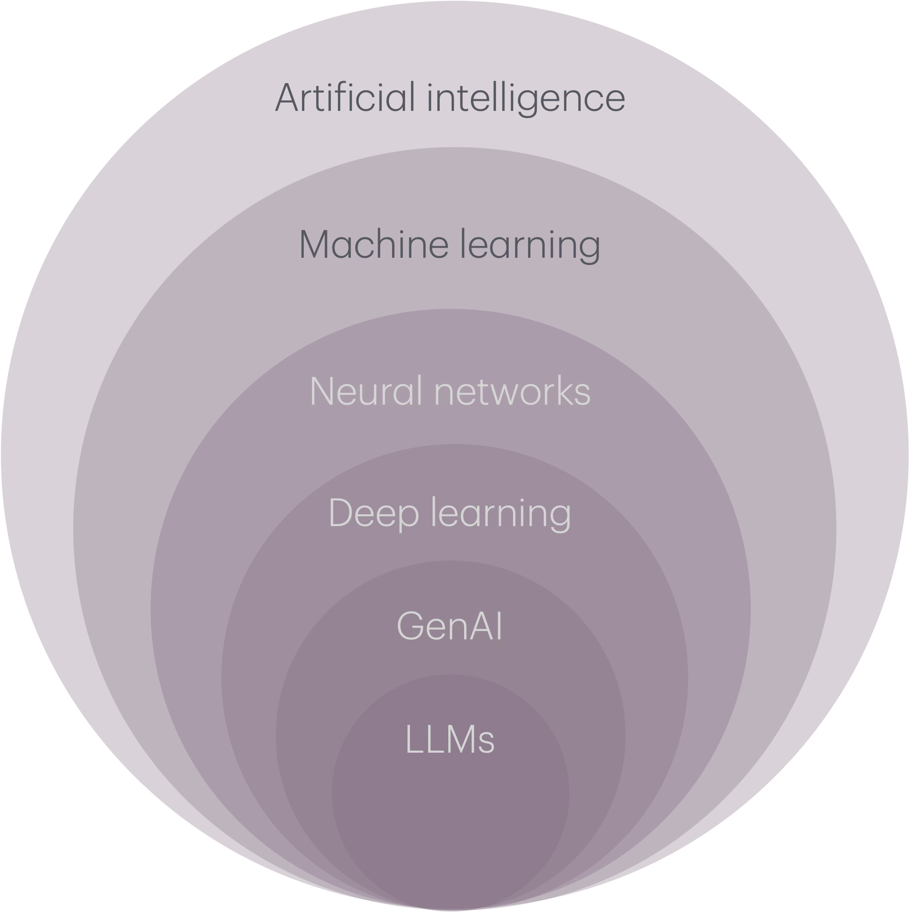
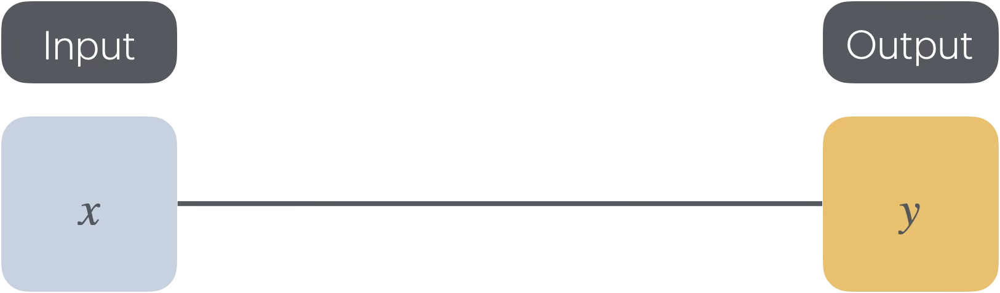
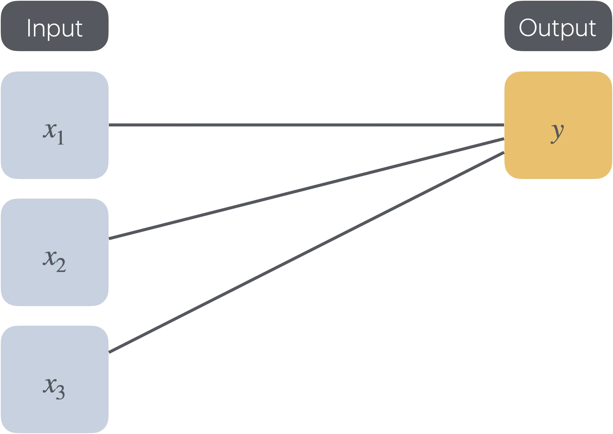
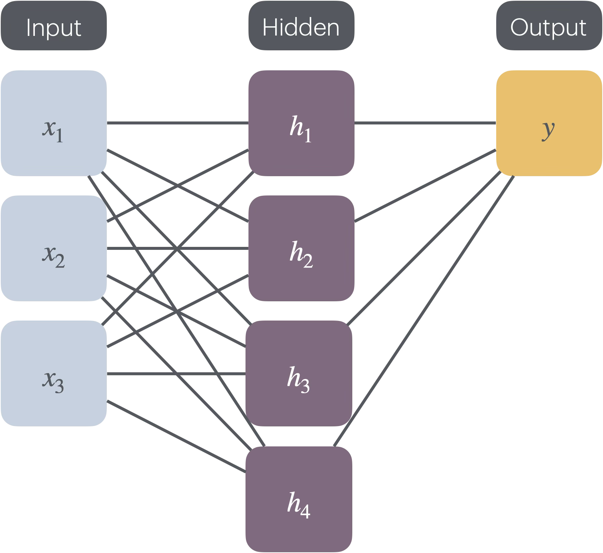

Content developed via conversations with Copilot to teach introduce first-year science students to the concepts behind GenAI. (Copilot generated the basic structure and themes, I have tweaked structure in some places and modified examples. In-class activities draw on my expertise in tertiary education.) I am a visual learner and this content is missing slides (and has a lot of words!) -- visuals pending :blush: This page contains:
- The intended learning objectives for the content. The teaching activities designed to reach the intended learning objectives are described below.
- Two-hours of lecture content. Desgined to be delivered synchronously, but can be adjusted to be asynchronous (polls can be run asynchronously, for example).
<!-- - Two-hours of applied class content. Including some python coding. -->

For advanced students, more theory would be introduced (e.g. mathematical formulae). For statistics students, the focus would focus more heavily on data and training. 

Intended learning objectives
======
- Explain what artificial intelligence is
- Describe the relationships and differences between artificial intelligence, machine learning, and GenAI
- Identify features of machine learning algorithms
- Understand the limitations, biases, ethical and environmental concerns regarding GenAI use

Two-hour lecture content
======
## Opening activity (7-ish minutes) 
- Poll asking students whether they have heard of GenAI, then ever used GenAI. (Show of hands. Anticipating almost everyone to have heard of and used GenAI tools, even if they have not realised it. This activity is more to gauge the engagement of the live audience, if it exists.)
- Anonymous online poll asking students how they *think* GenAI works. (Not too sure what to expect from this one! For an introductory class, this could vary. More for me to learn the knowledge base of those in the room.)
- Anonymous online poll asking students what prompt they would provide GenAI to tell them how GenAI works. (To start conversations around prompt engineering.)
- Use one of the student responses (if they exist) to ask Copilot, ChatGPT and Claude how GenAI works. Spend some time here unpacking the answer, guaging students' thoughts on the answer, e.g. using a 'hands up' poll asking students whether they *think* they understand how GenAI works after engaging with the different answers. Get them thinking about why they get different answers (and would get different answers from the same tool every time). 

## Introducing terms (4-ish minutes)
Don't want to overload students with terms here. An applied class activity will be to explore more specific terms in more detail. Introduce some of the most common. 

Will refer to the following diagram throughout the lecture: 

We will start by introducing Gen AI:

- GenAI: 'A category of artificial intelligence that can create new content such as text, images, videos and music.' (Source: [Organisation for Economic Co-operation and Development](https://www.oecd.org/en/topics/sub-issues/generative-ai.html), a definition also used by the [Australian Government](https://architecture.digital.gov.au/capability/generative-artificial-intelligence). Question for the class: how do different sources define GenAI? Why may the wording be different?) 

So what is the definition of artificial intelligence? (AI)
- AI: 'An AI system is a machine-based system that, for explicit or implicit objectives, infers, from the input it receives, how to generate outputs such as predictions, content, recommendations, or decisions that can influence physical or virtual environments.' (Source: [Organisation for Economic Co-operation and Development](https://oecd.ai/en/wonk/definition). Question for the class: do we 'like' this definition? What do and do we not like about it?)

## A short history of AI (8-ish minutes)
Okay, so how do these 'machine-based systems' work? Where have they come from?
- These ideas pre-date ChatGPT and the internet and the modern era! People have been interested in using machines to automate tasks that humans can do for a long time.
- BCE: [Ancient mythology approaches to AI](https://news.stanford.edu/stories/2019/02/ancient-myths-reveal-early-fantasies-artificial-life)
- The Turing test: can machines 'think'?
- Logic Theorist: computer program developed by Allen Newell, Herbert Simon, and Cliff Shaw to use symbolic logic to prove mathematical theorems. Why is this AI? It was programmed to mimic human reasoning. Why is it not GenAI? Because it used hard-coded (deterministic) rules to derive proofs. 
- ELIZA: a chatbot created in 1966 by Joseph Weizenbaum at MIT. Why is this AI? It was programmed to produce text simulating a psychotherapist. Why is it not GenAI? Because it uses pattern matching and substitutions to generate output text, it does not create 'new' content.
- Who is missing from this picture?

## Machine learning introduction (3-ish minutes)
As we have seen above, AI is a broad term that can cover a range of ideas. A subset of AI is machine learning:
- Machine learning: Machine learning (ML) is a field within artificial intelligence (AI) and computer science dedicated to using *data* and *algorithms* to help AI mimic human learning, thereby enhancing its precision over time. (Source: [Australian Government Architecture](https://architecture.digital.gov.au/capability/machine-learning))

The type of data and algorithms used depends on the problem we are trying to solve! Let's start with an example:

## Linear regression as an example of machine learning (35-ish minutes)
Opening activity: ask students who has heard of linear regression (I suspect all of them, but again this provides an opportunity for me to gauge engagement later in the lecture). Ask students who could explain linear regression to a high school student (to check their memory/confidence, which will guide how quickly I move through the revision activity). 

A lot of terms used in machine learning are similar to terms students will have met before, place these in context. Machine learning uses *data* to learn. There are certain terms that you may have met previously (e.g. when learning linear regression - will be treated with more thoroughly in a statistics setting) that have different names in the machine learning world. Opportunity to draw on other examples and content in the course that students connect with (e.g. examples from climate change, population dynamics, pharmacokinetics (the Lineweaver-Burk plot is a classic here), or epidemics).
- Recall linear regression that you may have met before. Let \\(Y\\) be a random variable representing the outcome we are interested in (for the Lineweaver-Burk plot, this would be \\(1/V\\), where \\(V\\) is rate of change of product of a chemical reaction). The random variable \\(Y\\) is sometimes referred to as the 'dependent', 'response', 'outcome' or 'target' variable. We wish to determine the relationship between our response variable and a 'predictor' variable \\(x\\) (for the Lineweaver-Burk plot, this would be \\(1/\[S\]\\), where \\(\[S\]\\) is the substrate concentration of a chemical reaction). The predictor variable is sometimes referred to as the 'independent', 'explanatory' variable or 'covariate'. (Before diving in to a linear model, we should perform an [exploratory data analysis](https://www.ibm.com/think/topics/exploratory-data-analysis) to convince ourselves that a linear model may be an appropriate starting point for the relationship between \\(Y\\) and \\(x\\)). The linear statistical model relating \\(Y\\) and \\(x\\) is:

$$Y = \alpha + \beta x + \epsilon,$$

where \\(\alpha\\) and \\(\beta\\) are regression parameters representing the intercept and slope of the regression line, respectively. (You may have seen things of the form \\(y = m x + c\\) (or \\(y = a x + b\\)) in a past life, notation can vary between sources, this is something to look out for when using GenAi to study!) The \\(\epsilon\\) term is a(nother) random variable representing the error in the model, usually with distributed as \\(\mathcal{N}(0,\sigma^2)\\), where \\(\sigma^2\\) is the variance of error. In linear regression, we use \\(n\in\mathbb{N}\\) observations of our predictor variable \\(x_{i}\\) and outcome random variable, denoted \\(y_{i}\\), with \\(i\in\{1, \ldots, n\}\\) and least squares estimation to determine our regression parameters. 

In machine learning land, there also exists the concept of linear regression, but they use different terminology:

| Symbols | Math words | Machine learning words |
| --- | --- | --- |
| \\(x\\) | Independent variable | Feature |
| \\(y\\) | Dependent variable | Label |

The *data* our machine learning algorithm *trains* on is an input, typically rows and columns. Each row of the dataset is referred to as an *example* and the columns are features and/or labels. In machine learning land, we are trying to identify relationships between features and labels.

The *parameters* in our 'old school' linear regression model are \\(\beta\\), the slope of our regression line, and \\(\alpha\\), the intercept. These also have corresponding names in maching learning land:

| Symbols | Math words | Machine learning words |
| --- | --- | --- |
| \\(\beta\\) | Slope | Weight |
| \\(\alpha\\) | Intercept | Bias |

Here's where things get more interesting. In the classic least squares regression we have met before, we systematically identify the values of \\(\beta\\) and \\(\alpha\\) that minimise the sum of squares of the residuals, where the residuals are the difference between the observed and predicted values. But we could define other functions to minimise over that are not sums of squares. (Some) machine learning algorithms also require a function to minimise the difference between predicted and observed values. These functions are referred to as *loss functions*. We are always seeking to minimise loss functions!

When you have multiple *features* and large datasets, how do we find the corresponding parameter values that minimise our loss function? This is an *optimisation* question. (If you are interested in these sorts of questions, an Optimisation and Operations Research Major could be for you!) A common approach is known as *gradient descent*. Writing our loss function as a function of the weight, \\(w\\) and bias, \\(b\\), we have \\((L(w, b))\\), where the form of \\(L\\) depends on the loss function being used. From this, we can calculate the (partial) derivatives of \\(L\\) with respect to \\(w\\) and \\(b\\), in other words, \\(\frac{\partial L}{\partial w}\\) and \\(\frac{\partial L}{\partial b}\\). This optimisation algorithm uses multiple iterations. Suppose that at iteration \\(j\in\\mathbb{N}\\) the weight and bias take values \\(w_{j}\\) and \\(b_{j}\\), then at iteration \\(j+1\\) under the gradient descent algorithm, the weight and bias will have values:

$$w_{j+1} = w_{j} - \gamma  \frac{\partial L}{\partial w} \Bigg\rvert_{(w, b) = (w_{j}, b_{j})}$$

$$b_{j+1} = b_{j} - \gamma  \frac{\partial L}{\partial b} \Bigg\rvert_{(w, b) = (w_{j}, b_{j})},$$

where \\(\gamma\\) is a parameter determining the step size of the algorithm, often referred to as the *learning rate*. The algorithm continues iteratively until the loss function *converges* (this may not be convergence in the strict mathematical sense). What choices have we had to make so far? Loss functions and step sizes for our optimisation algorithm! What might the implications be for our predictions?

<!-- ## Logistic regression as an example of machine learning (25-ish minutes)
Ask students for examples of yes/no questions. If there is a good example from the class use it, otherwise have a back up option of image recognition (e.g. using a blurred photo of Taylor Swift, or someone else from popular culture [does such a thing still exist?] - the `good' thing about this example is that facial recognition is a technology that is being used, and this example allows students to reflect on the potential flaws and issues with the technology). -->

## Brain break (5 minutes)
For activities longer than one hour, I always allow a few minutes for breath for students (and myself!)

## From linear regression to neural networks (10-ish minutes)
Visually, we can think of linear regression with one feature as:

If we had multiple features:

(Note: here the subscripts do not denote observations, but rather multiple inputs. Clashing with notation from earlier!)

What if we performed linear regression twice, something like:

With the three inputs being used in a linear model to generate \\(h_{1}\\), then a linear model with different weights and bias to produce \\(h_{2}\\) and different weights and bias again to \\(h_{3}\\) and \\(h_{4}\\). Then there is another linear model to produce \\(y\\) from \\(h_{1}\\), \\(h_{2}\\), \\(h_{3}\\) and \\(h_{4}\\). What would we gain from this? Not a lot in most cases! Here we have used linear *activation functions* between our layers, and linear combinations of linear functions are themselves linear. But what if we choose a different function? A common non-linear function is the sigmoid function:

Using a non-linear function, and combinations of non-linear functions, allow us to explore a richer input -> output world, not restricted to linear relationships! 

-  Neural network learns and weights and biases across multiple layers, from input to outputs and hidden layers in between, via activation function (which may differ between layers), to be able to map inputs to outputs. 
- The benefit of using multiple layers and different activation functions are that the neural network can learn increasingly complex functions. A disadvantage is that having many layers can be computationally expensive.
- Neural networks can be tuned using *backpropagation* as well as forward passes. [See the delightful (pre-ubiquitous GenAI) video by 3Blue1Brown, for example.](https://www.youtube.com/watch?v=Ilg3gGewQ5U) 
- Not all neural networks use gradient descent during training, indeed, some do not use loss functions at all!

## Supervised vs. unsupervised learning (5-ish minutes)
Before the break we introduced linear regression in the context of machine learning. This was an example of *supervised* machine learning, where the *examples* contained *features* and *labels*. Unsupervised machine learning uses datasets *without* labels. These two kinds of machine learning serve different purposes. 
- Supervised machine learning: classification, regression tasks
- Unsupervised machine learning: clutsering, association, dimensionality reduction tasks

## From neural networks to GenAI (20-ish minutes)
- *Deep learning* uses multi-layered neural networks to infer *even more* complicated relationships between inputs and and outputs. Usually, they are so complex, they are referred to as a *black box*. These kinds of approaches are often used in GenAI.
- *Transformers* are a kind of deep learning used for *sequential* data, such as text. Transformers consist of:
	- *Encoders*: takes raw data (e.g. text) and convert them into some other form, such as a vector.
	- *Decoders*: takes data in this 'other form' (determined by the encoder) and convers it back into output form (e.g. text).
- *Attention mechanisms*: in this room right now, there is a lot going on, so how do you knw what to pay attention to? Maybe it is not so relevant right now that there is an empty seat in the room, so you do not look at a specific empty seat. How can deep learning models do something similar? They *weigh* relationships between words (for example) relative to other sequences.
- Transformers often use *self-attention*, weighting relations between words in the input sequence.
<!-- - *Language models* estimate the probability of a word (for example) appearing in a sequence of words. (Probabilities aren't exclusively applied to words, they can also be applied to characters, subwords, sentences, paragraphs or longer pieces of text.) -->
- *Large language models* use transformers to predict text -- GenAI!

## Limitations, biases, ethics and cost (15-ish minutes)
- All of these complex models require *a lot* of resources to compute 
- Performing all of the relevant calculations requires a lot of energy, not only to run the calculations themselves, but also to keep the computers from overheating while running them (sometimes cooling can be water intensive)
- Are we moving to a 'token economy', where GenAI tokens become a tradable commodity? What would the implications be for society?
- Not only is there a great physical cost to running GenAI models, but they are only as 'good' as their input data. What is the data that feeds GenAI? Who is (and isn't) represented in that data? What could that mean for GenAI responses?
- Considering all of the above, who gets to have access to GenAI? Who doesn't? What are the implications of this?

## Summary (5-ish minutes)
Our intended learning objectives were:
- Explain what artificial intelligence is
- Describe the relationships and differences between artificial intelligence, machine learning, and GenAI
- Identify features of machine learning algorithms
- Understand the limitations, biases, ethical and environmental concerns regarding GenAI use

Can we do these yet? What needs further clarifying? You can (noting some of the costs above!) create your own Copilot Notebook to probe the limits of this content! 

Closing image for the introducing terms section: 

Within each of these concepts, there is so much more we have not yet covered! There will be an opportunity to explore these further in the applied class.

<!-- Making a start on
Two-hour applied class content
======
Drawing on the content from the lecture, we wish to expand students' understanding of terms by giving them the tools to explore concrete examples. 

## Activity 1
In lectures, the terms generative artificial itnelligence, artificial intelligence and machine learning were introduced. The first activity for this activity class is to explore an artificial intelligence topic in more detail. Choose one of the terms below, or another term of your choice, to explore during the class:
- Neural networks
- Deep learning
- LLMs
-->